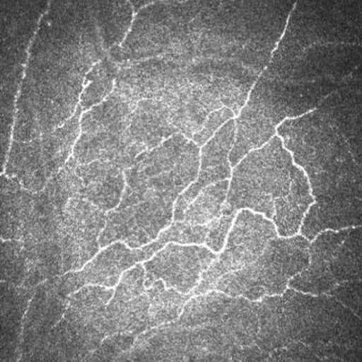
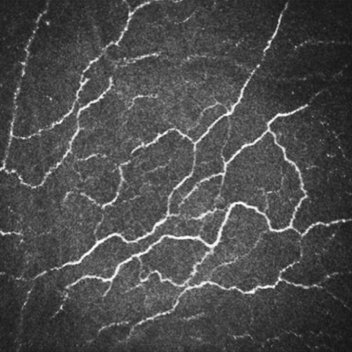
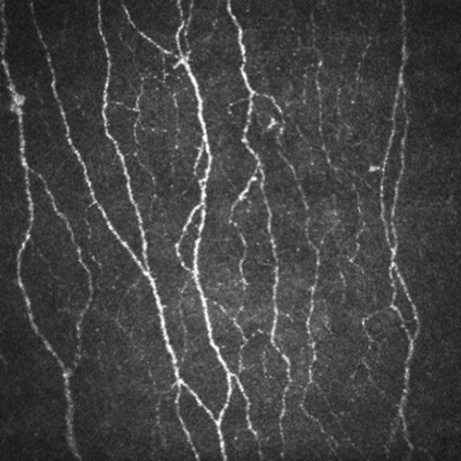

## 🚀 StillGAN Pre-trained Weights (CORN-2)

This repository provides the unofficial pre-trained weights for **StillGAN**, trained on the **CORN-2** dataset. Since the [official implementation](https://github.com/iMED-Lab/StillGAN) does not provide weights, this release aims to help researchers reproduce the results on corneal related tasks.

### 📊 Training Configuration
- **Base Code:** [iMED-Lab/StillGAN](https://github.com/iMED-Lab/StillGAN)
- **Dataset:** CORN-2
- **Training Epochs:** 30
- **Total Iterations:** 10,000
- **Environment:** PyTorch

### 📦 Weights Download
You can download the weights from the following link:
- **[Hugging Face Repository](https://huggingface.co/jugking6688/StillGAN-CORN-Pretrained-Weights-Unofficial)** (Recommended)

### 🖼️ Evaluation Results
Below are the sample results from the test set:

|          Real Image (Input)          |        Fake Image (Generated)        |
|:------------------------------------:|:------------------------------------:|
|       |       |
|         |         |
